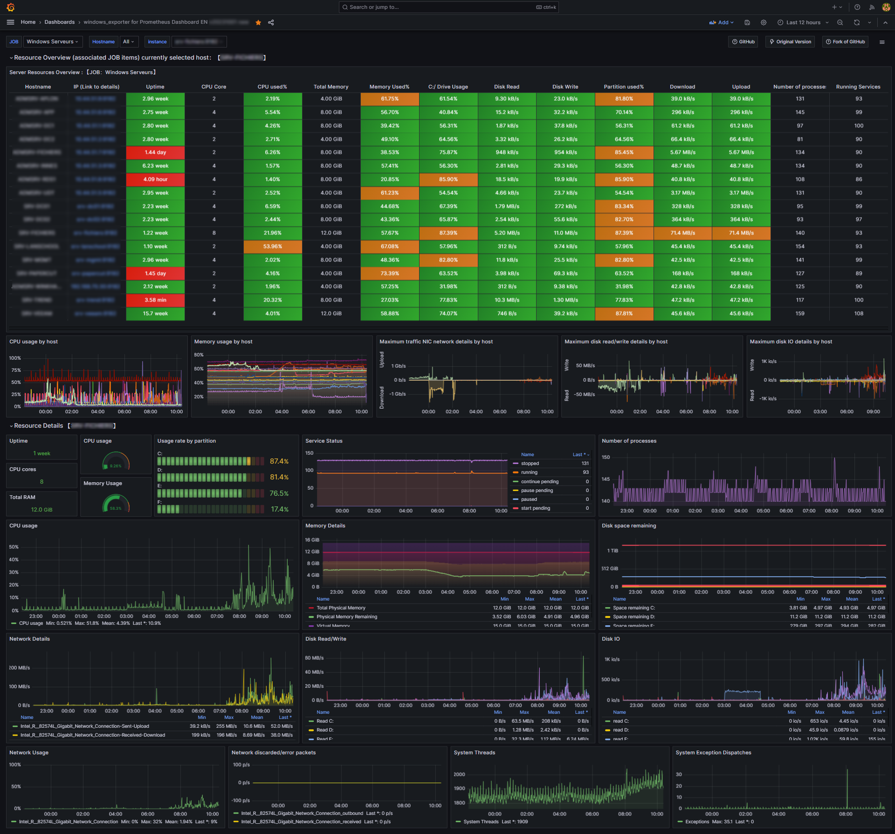

# Windows Dashboard

This is a translation and update of this original dashboard version :

- https://grafana.com/grafana/dashboards/10467
- https://github.com/starsliao/Prometheus/tree/master/windows_exporter

:no_entry: The Alert rules are in test phase, at your own risk

Due to the depreciation of the angular plugin, I migrated the dashboard to React.  
The only thing that's a bit disturbing about the react version is that the table is a bit large ...  
No option yet exists to reduce it

## Screenshot (Old version)

The old version of the dashboard is available [here](windows_exporter/windows_exporter%20for%20Prometheus%20Dashboard%20EN%20v20231002%20old.json)

## Screenshot (migrated to react)

The dashboard json file is available [here](windows_exporter/windows_exporter%20for%20Prometheus%20Dashboard%20EN%20v20231002%20new.json)

